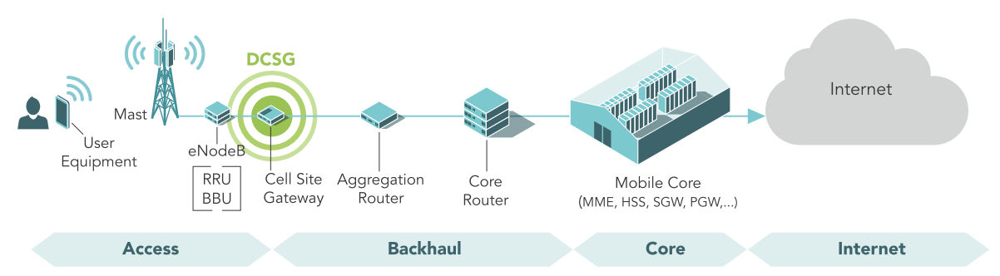

🚀 Exciting News: Embarking on a Major Network Automation Project!

Hello everyone! I'm thrilled to share that I will be working on a major network automation project for a service provider customer this year. This project is a unique opportunity to leverage the knowledge I've gained throughout my career in network engineering and automation.

- **Project Overview:**

The primary goal of this project is to manage the lifecycle of Cell Site Gateway routers and automate the process end-to-end. This will involve seamless interaction with both Business Supporting Systems (BSS) and Operations Supporting Systems (OSS).

- **Why This Matters:**

Automating the lifecycle of network devices like Cell Site Gateways is crucial for enhancing operational efficiency, reducing manual errors, and improving service delivery. By streamlining these processes, we can focus on delivering superior connectivity and service quality of the service provider.

🔜 **Looking Forward:** 🔜

In my next post, I'll dive into the **macro tech stack** we'll be using for this project, so stay tuned! I'm excited to share insights and learnings from this journey, and I welcome your thoughts and feedback along the way.
Feel free to connect if you're interested in network automation or have insights to share. Let's engage and learn together!

[Optional: Attach a relevant image or diagram illustrating network automation or Cell Site Gateways]