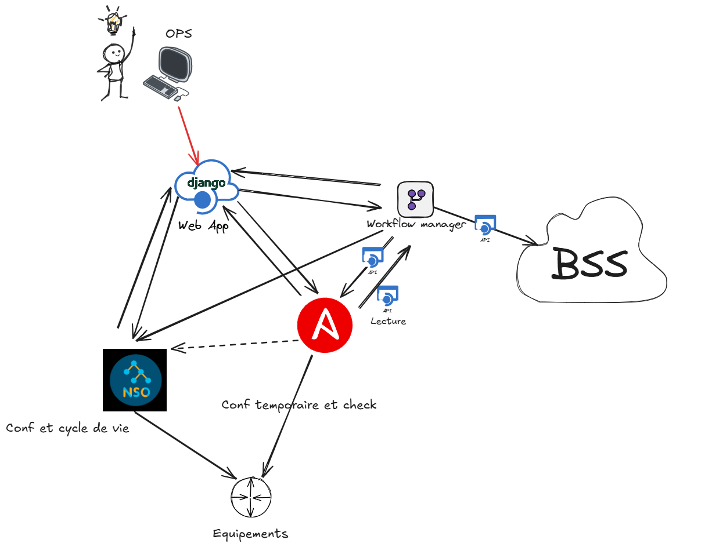

# Tech stack

🌟 Tech Stack Reveal for Our Network Automation Project 🌟

I'm excited to share the technological backbone that will power our major network automation project. At the heart of our stack is Django, which will serve as the central hub of our web application, orchestrating interactions across various critical systems.

🔗 Key Components of Our Tech Stack:

1. Django (Web App):

Django will be the core of our application, providing a robust framework for building our web interface, handling data interactions, and ensuring seamless communication with other components.

2. NSO (Network Services Orchestrator):
We'll leverage NSO for automating network services and configurations, ensuring efficient **lifecycle** management of network devices.

3. AAP (Ansible):
Ansible will empower us to automate IT tasks and streamline operations, providing a flexible and scalable solution for managing our network infrastructure.

4. Workflow Manager:
Our Workflow Manager will streamline business processes and also ensuring the alignement between the network field and Business Supporting System.

5. Business Supporting Systems (BSS):
Integration with various BSS applications will be critical for maintaining business operations and ensuring that network changes align with organizational goals.

**Why This Stack?**
By making an interaction and a custom user interface between these systems. We're aiming to create an efficient system to manage Cell Site Gateway devices and we hope later expand it to mobile aggregation and radio devices.

🔜 **Looking Forward:** 🔜

I'm thrilled to see how this tech stack will come together to transform our network operations. Stay tuned for more updates as we will dive deeper into the **tech stack of the Django Webapp** itself.
I'm eager to hear your thoughts and experiences with similar technologies. Let's connect and discuss the future of network automation!

